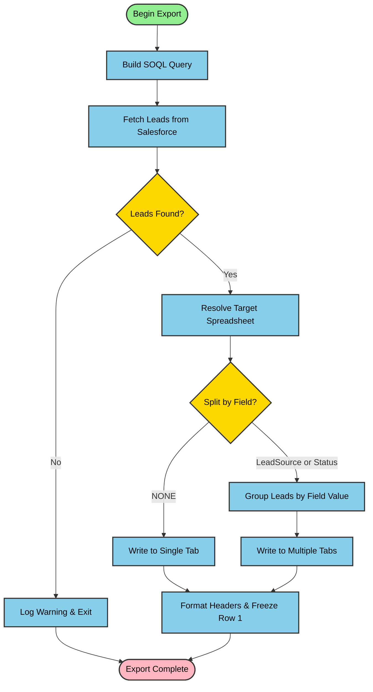

# Integration Flow Diagram

## Flow Description

1. **Begin Export**: Integration starts execution
2. **Build SOQL Query**: Constructs SOQL query based on configuration (field mapping, filters, incremental sync)
3. **Fetch Leads**: Queries Salesforce for Lead records
4. **Leads Found?**: Checks if any leads match the query criteria
5. **Log Warning & Exit**: If no leads found, logs warning and exits gracefully
6. **Resolve Target Spreadsheet**: Uses existing spreadsheet ID or creates new one
7. **Split by Field?**: Checks if leads should be split into multiple tabs
8. **Group Leads**: Groups leads by LeadSource or Status field value
9. **Write to Single Tab**: Writes all leads to configured tab name
10. **Write to Multiple Tabs**: Writes each group to separate tabs
11. **Format Headers & Freeze Row 1**: Applies formatting to spreadsheet
12. **Export Complete**: Integration execution completes successfully
