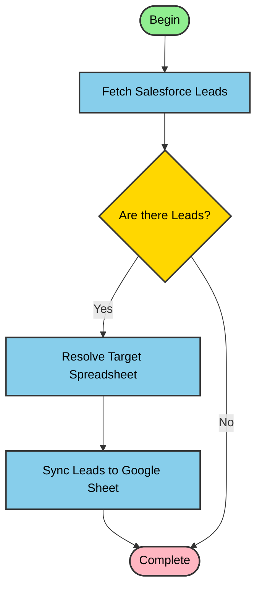

```mermaid
flowchart TD
    A(["Begin"]):::startNode
    B["Fetch Salesforce Leads"]:::processNode
    C{"Are there Leads?"}:::decisionNode
    D["Resolve Target Spreadsheet"]:::processNode
    E["Sync Leads to Google Sheet"]:::processNode
    F(["Complete"]):::endNode

    A --> B --> C
    C -- Yes --> D --> E --> F
    C -- No --> F

    classDef startNode fill:#90EE90,stroke:#333,stroke-width:2px,color:#000
    classDef processNode fill:#87CEEB,stroke:#333,stroke-width:2px,color:#000
    classDef decisionNode fill:#FFD700,stroke:#333,stroke-width:2px,color:#000
    classDef endNode fill:#FFB6C1,stroke:#333,stroke-width:2px,color:#000
```
